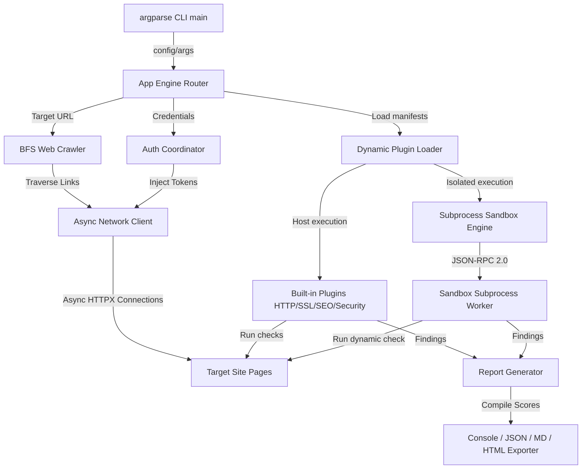

# WebPulse 🌐
> **Enterprise-Grade Asynchronous Website Auditing & Security Scanner CLI**

[](https://www.python.org/)
[](https://github.com/astral-sh/ruff)
[](https://github.com/python/mypy)
[](#)
[](#)

WebPulse is a premium, async-first website scanner designed to crawl, audit, and score target sites across security, performance, accessibility, and SEO vectors. Built with strict static typing, robust subprocess plugin sandboxing (using JSON-RPC 2.0), and a modern CLI, WebPulse provides deep site quality checks and exports clean reports in Console, JSON, Markdown, and HTML format.

---

## 🚀 Key Features

* **🕸️ Async BFS Crawler**: High-performance, concurrent crawler traversing links up to configured `max_depth` and `max_pages` bounds. Avoids crawling restricted routes using regex path filtering and respects domain scopes.
* **🔑 Credentials-Based Session Manager**: Simulates user authentication (form and JSON POST methods), extracts session cookies or token headers, and automatically injects them into subsequent HTTP requests.
* **🛡️ Secure Dynamic Plugin Sandbox**: Safely executes third-party plugins in isolated subprocesses using a JSON-RPC 2.0 communication pipeline. AST scanner statically blocks forbidden imports (e.g. `sys`, `subprocess`, `os` file operations) to guarantee host security.
* **📊 CVSS-Inspired Scoring Engine**: Computes exact single-page quality scores, aggregates subpage ratings using root-to-subpage weights, and subtracts explicit security penalties (like failing authentication).
* **🖥️ Premium Multi-Format Reporting**:
  * **Console**: Color-coded CLI summary output with try-except Windows codec protection.
  * **JSON**: Validated reports compliant with standard schemas.
  * **Markdown**: Clean, structured collapsible tables and lists.
  * **HTML Dashboard**: Responsive, interactive dark-mode dashboard with circular SVG gauges, filtering buttons, and expandable finding details.

---

## 📐 Architecture Overview

WebPulse utilizes a modular, dependency-injected design separating network requests, crawler queues, plugins execution, and reporting writers:



---

## 📁 Repository Structure

```
├── .ai/                       # Roadmap specifications and architectural guidelines
├── .github/                   # GitHub CI/CD workflow configurations
├── docs/
│   └── specs/                 # Full developer specifications (scoring, plugin system, etc.)
├── examples/                  # Integration and profile configuration files
├── plugins/                   # Folder for third-party dynamic plugins
├── src/
│   └── webpulse/
│       ├── cli/               # CLI parser and command routers
│       ├── core/              # Config, exceptions, crawler, auth, sandbox engines
│       ├── modules/           # Built-in analyzers (HTTP, SSL, SEO, Security)
│       ├── reports/           # Scoring engines, schemas, and template writers
│       └── utils/             # Async HTTPX network client (SSRF filters), HTML parser
├── templates/                 # HTML dashboard responsive blueprints
└── tests/                     # Unit and integration test suites
```

---

## 🛠️ Installation & Setup

Ensure you have **Python 3.11+** installed on your system.

### 1. Initialize Virtual Environment & Install
```bash
# Clone the repository
git clone https://github.com/userlethekhoi/webpulse-audit.git
cd webpulse-audit

# Initialize virtualenv
python -m venv venv

# Activate virtualenv (Linux/macOS)
source venv/bin/activate
# Activate virtualenv (Windows PowerShell)
.\venv\Scripts\Activate.ps1

# Install in editable mode with development dependencies
pip install -e .[dev]
```

### 2. Verify Installation
```bash
webpulse --help
```

---

## 💻 CLI Usage Examples

### 1. Run a Fast Website Audit Scan
Scan a target website with console report outputs:
```bash
webpulse scan https://example.com -f console
```

### 2. Perform a Deep Crawled Scan
Limit crawler traversal to a depth of 2 and a maximum of 10 pages:
```bash
webpulse scan https://example.com -f console,html,json --max-depth 2 --max-pages 10
```

### 3. List Discovered Built-in & Custom Plugins
```bash
webpulse plugins list
```

### 4. Display or Modify Configuration Profiles
```bash
# View active configuration values
webpulse config show

# Update crawler pages configuration
webpulse config set crawler.max_pages 20
```

---

## 🔒 Security Sandboxing & SSRF Protections

WebPulse is built with defensive design at its core:
* **Private IP Blocklist (SSRF Protection)**: The custom `AsyncNetworkClient` blocks any requests resolving to private ranges (RFC 1918, RFC 6890, loopback, or multicast) by default to prevent attackers from querying internal server resources. Enable local scanning via `--allow-private-ips`.
* **Subprocess Isolation**: Third-party plugins execute in a separate python subprocess. They are not allowed to call direct APIs or mutate variables inside the main WebPulse thread.
* **AST Validation Gate**: Prior to executing any plugin, its source files are parsed into an Abstract Syntax Tree (AST) and scanned for prohibited imports. The engine blocks imports of libraries like `subprocess`, `os`, `sys`, or `shutil` unless explicitly white-listed in the manifest.

---

## 🧪 Quality Assurance & Test Suites

We enforce extremely high development quality standards:
* **Strict Static Typing**: Configured with `mypy --strict` to verify type safety across all components.
* **100% Linter Compliance**: Ruff checks and formats are verified before every commit.
* **Pytest Coverage**: Comprehensive suite asserting crawlers, session auth coordinate logic, scoring aggregates, and CLI pipelines.

### Run Tests:
```bash
pytest
```

### Run Linters & Static Type Checking:
```bash
# Style compliance
ruff check src/ tests/

# Type checking
mypy src/
```

---

## 📄 License
This project is licensed under the MIT License - see the LICENSE file for details.
