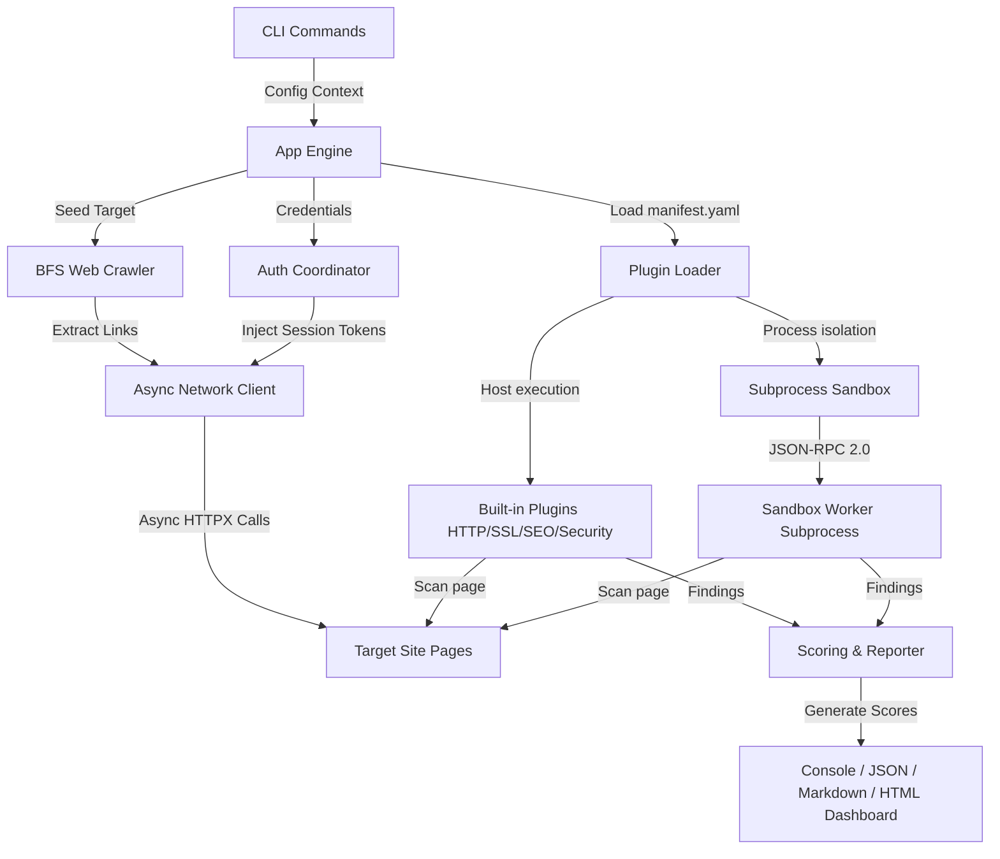

<div align="center">

# 🌐 WebPulse
### *Enterprise-Grade Asynchronous Website Quality & Security Auditor*

[](https://www.python.org/)
[](https://github.com/astral-sh/ruff)
[](https://github.com/python/mypy)
[](LICENSE)
[](https://github.com/userlethekhoi/webpulse-audit)

**WebPulse** is a high-performance, command-line interface (CLI) tool that crawls, audits, and rates target websites across multiple quality dimensions. Written in modern Python using strict static typing, WebPulse analyzes targets for security vulnerability exposures, performance delays, search engine optimization (SEO), and accessibility compliance, delivering clean, actionable metrics.

[Key Features](#-key-features) • [Architecture](#-architecture-overview) • [Installation](#-quick-start) • [Usage](#-usage-examples) • [Security & SSRF](#-security--sandboxing) • [Test Suite](#-qa--ci-metrics)

</div>

---

## ✨ Key Features

* **🕸️ Async BFS Crawler**: Crawl internal routes concurrently up to configured depth and page limits. Normalizes query parameters, matches path exclusion regexes (e.g. `/logout`), and respects domain boundaries.
* **🔑 Authentication Coordinator**: Handles dynamic form and JSON POST credentials checkups. Captures session cookies or header tokens and injects them automatically into successive scans.
* **🛡️ Subprocess Sandbox Engine**: Runs third-party plugins in safe, isolated subprocesses via JSON-RPC 2.0. A built-in Abstract Syntax Tree (AST) validator blocks unauthorized imports (like `os` or `subprocess` without permission) at startup.
* **📊 CVSS-Inspired Scoring**: Calculates individual page category scores, applies weighted aggregation formulas (Root page: 50%, Subpage average: 50%), and subtracts penalization offsets for auth failures.
* **🎨 Premium Exporters**: Generates colorized console listings, strict JSON outputs, collapsible Markdown logs, and a responsive HTML interactive dashboard with inline SVG gauge metrics.

---

## 📐 Architecture Overview

WebPulse utilizes a modular, dependency-injected design to separate networking, link discovery, plugin execution, and report generation:



---

## 📦 Core Auditing Modules

WebPulse ships with **4 core built-in analyzer plugins**:

| Category | Analyzer Module | Key Auditing Targets |
| :--- | :--- | :--- |
| **🔒 Security** | `webpulse-security-analyzer` | Missing security headers (`CSP`, `HSTS`, `XSS-Protection`), insecure cookie flags (`HttpOnly`/`Secure`), and secret path exposures (`.git/config`, `.env`). |
| **🌐 HTTP** | `webpulse-http-analyzer` | Protocol handshakes (`HTTP/2`, `HTTP/3`), redirection chain bounds, compression headers (`gzip`, `brotli`), and server error responses. |
| **🔑 SSL/TLS** | `webpulse-ssl-analyzer` | Certificate validation checks, cipher strengths, expiry timelines, and certificate authority validity. |
| **📈 SEO** | `webpulse-seo-analyzer` | Optimal title & description lengths, meta tags, heading hierarchies (`<h1>`), images alt text, and canonical link configurations. |

---

## 🛠️ Quick Start

### 1. Prerequisites
- **Python 3.11+** installed
- **Git** configured

### 2. Installation
Clone the repository and install the package in editable mode along with development tools:
```bash
# Clone
git clone https://github.com/userlethekhoi/webpulse-audit.git
cd webpulse-audit

# Initialize virtualenv
python -m venv venv
source venv/bin/activate  # On Windows use: .\venv\Scripts\activate

# Install with dev dependencies
pip install -e .[dev]
```

---

## 💻 Usage Examples

### 🔍 Run an Audit Scan
Start a concurrent crawler scan on the target site and output the report to the console:
```bash
webpulse scan https://example.com -f console
```

### 📋 Multi-Format Export
Perform a scan and export reports to Console, HTML, and JSON formats:
```bash
webpulse scan https://example.com -f console,html,json --output ./reports/my-scan
```

### 🔌 Query & Manage Plugins
```bash
# List all active plugins
webpulse plugins list

# Validate a custom plugin manifest
webpulse plugins validate ./plugins/my_custom_plugin
```

### ⚙️ View and Configure Settings
```bash
# Show active configuration settings
webpulse config show

# Set connection rates or crawling depths
webpulse config set crawler.max_pages 25
```

---

## 🖥️ Terminal Execution Mockup

Here is an example output when running a scan with the WebPulse CLI:

```ansi
======================================================================
 WEBPULSE WEBSITE AUDIT REPORT
 Target:       https://example.com
 Date:         2026-06-29T18:00:00Z
 Crawler:      BFS Scanned 2/2 Pages (Max Depth: 1)
 Auth Status:  DISABLED (Enabled: False)
======================================================================

 [*] OVERALL HEALTH SCORE: 92 / 100
 [!] RISK SCORE:            0.8 / 10

 Category Breakdown:
 - [Security]      85/100
 - [SEO]           95/100
 - [Performance]   100/100
 - [Accessibility] 100/100

----------------------------------------------------------------------
 Discovered Findings:

 [MEDIUM] (Confidence: 1.0) - Missing Content-Security-Policy Header
  - URL:         https://example.com/
  - Description: The Content-Security-Policy (CSP) header is missing from HTTP responses.
  - Remediation: Configure the web server to append a strict Content-Security-Policy response header.

 [HIGH] (Confidence: 1.0) - Missing Strict-Transport-Security Header
  - URL:         https://example.com/
  - Description: The Strict-Transport-Security (HSTS) header is missing from HTTPS responses.
  - Remediation: Configure the server to return a 'Strict-Transport-Security' header.
======================================================================
```

---

## 🛡️ Security & Sandboxing

* **🚫 Private IP Protection (SSRF Prevention)**: The core network coordinator client automatically blocks outbound network calls destined for private IP addresses (RFC 1918, RFC 6890, loopback, or local link ranges). Scanning local servers can be bypass-enabled with `--allow-private-ips`.
* **🔒 AST Validation Gate**: Dynamically loaded third-party plugins are evaluated against an Abstract Syntax Tree (AST) checker at load time. The engine rejects any plugin importing unsafe standard packages (e.g. `subprocess`, `os`, `sys`, `shutil`) unless authorized.
* **⚙️ Isolated Subprocess**: Sandbox plugins are executed in separate Python subprocesses, exchanging messages strictly via stdin/stdout using JSON-RPC 2.0.

---

## 🧪 QA & CI Metrics

WebPulse enforces high-quality coding practices:
* **Strict Typing**: Validated with `mypy --strict` to verify type annotations.
* **Style Compliance**: Formatting and linting standards verified by `ruff`.
* **Testing Matrix**: Pytest suite covering all crawling, sandbox, reporting, and scoring engines.

```bash
# Run test suite
pytest

# Check style
ruff check src/ tests/

# Type check
mypy src/
```

---

## 📄 License

This project is licensed under the MIT License - see the [LICENSE](LICENSE) file for details.
