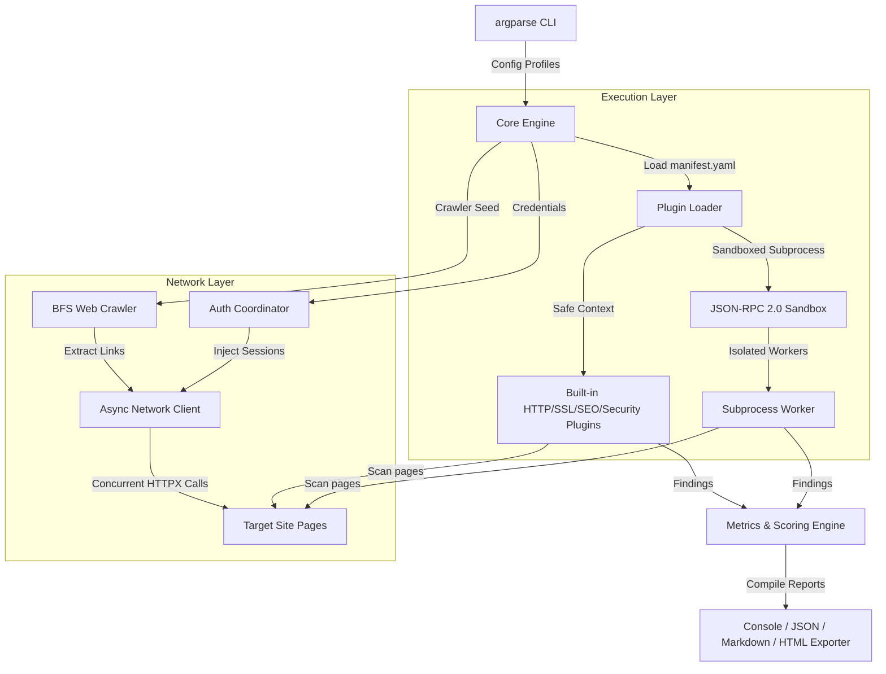

<div align="center">

# 🌐 WebPulse (v2.0)
### *Advanced, Async-First Website Quality Auditing & Security CLI Scanner*

[](https://www.python.org/)
[](https://github.com/astral-sh/ruff)
[](https://github.com/python/mypy)
[](LICENSE)
[](https://github.com/userlethekhoi/webpulse-audit)

**WebPulse** is a high-performance command-line tool built to crawl, analyze, and grade websites across multiple technical dimensions. Featuring a fully sandboxed plugin engine, an asynchronous crawling queue, and strict type safety, WebPulse generates premium reports in HTML, JSON, Markdown, and Console formats.

---

### [Documentation & Specs](docs/specs) • [Key Features](#-key-features) • [How it Works](#-architecture--how-it-works) • [Quick Start](#-quick-start) • [Usage Examples](#-usage-examples) • [Sandbox Security](#-sandboxing--ssrf-protection)

</div>

---

## 💡 Why WebPulse?

Unlike generic scanners that only look at static page resources, WebPulse treats website auditing as a first-class defensive engineering task. 

* **⚡ Async-First Performance**: Every HTTP request, link discovery task, and plugin execution is managed using Python’s `asyncio` event loop, running tasks concurrently without freezing resource handles.
* **🛡️ Hardened Sandbox Security**: Third-party plugins run inside isolated subprocess containers. Their code is statically audited via Abstract Syntax Trees (AST) before load time to prevent host command injection or local file leaks.
* **🔧 Zero-Trust SSRF Protection**: The core network driver is blocklist-guarded, preventing SSRF attacks targeting private networks (`127.0.0.1`, `10.0.0.0/8`, etc.) during traversal.
* **📊 CVSS-Based Deductions**: Scoring is calculated using custom mathematical category weights (Security, Performance, SEO, Accessibility) to generate realistic health ratings rather than simple error counts.

---

## ✨ Key Features

* **🕸️ BFS Crawler Queue**: Concurrently traverses pages up to configured limits. Normalizes path queries and respects exclusion patterns (like `/logout`).
* **🔑 Authentication Coordinator**: Automated form and JSON POST credentials login handler. Captures tokens and injects cookies or auth headers dynamically into successive target scans.
* **🔌 Dynamic Plugin Loader**: Discovers and runs modules containing `manifest.yaml` configurations.
* **🎨 Premium Exporters**: Colorized ANSI console lists, markdown summary sheets, strict JSON schemes, and an interactive dark-mode HTML dashboard complete with gauges and filters.

---

## 📐 Architecture & How It Works

WebPulse implements a decoupled architecture where core engines communicate via DI (Dependency Injection) containers:



---

## 📦 Built-in Auditor Modules

WebPulse ships with **4 core built-in analyzer plugins**:

| Category | Analyzer Module | Key Auditing Targets |
| :--- | :--- | :--- |
| **🔒 Security** | `webpulse-security-analyzer` | Audits response headers (`CSP`, `HSTS`, `X-Frame-Options`, `X-Content-Type-Options`), insecure cookie flags (`HttpOnly`/`Secure`), and probes for server path exposures (`.git/config`, `.env`). |
| **🌐 HTTP** | `webpulse-http-analyzer` | Scans protocol handshakes (`HTTP/2`, `HTTP/3`), redirection chain bounds, compression headers (`gzip`, `brotli`), and server error responses. |
| **🔑 SSL/TLS** | `webpulse-ssl-analyzer` | Inspects certificate chain validation state, issuer signatures, expiry timelines, and cipher suites. |
| **📈 SEO** | `webpulse-seo-analyzer` | Audits title/description bounds, meta tags, heading structures (`<h1>`), image alt text, and canonical link configurations. |

---

## 🛠️ Quick Start

### 1. Requirements
- **Python 3.11+**
- **Git**

### 2. Installation
```bash
# Clone
git clone https://github.com/userlethekhoi/webpulse-audit.git
cd webpulse-audit

# Set up virtual environment
python -m venv venv
source venv/bin/activate  # On Windows use: .\venv\Scripts\activate

# Install in editable mode with development dependencies
pip install -e .[dev]
```

### 3. Verify
```bash
webpulse --help
```

---

## 💻 Usage Examples

### Basic Target Audit Scan
Run a concurrent crawl audit on the target site and output the report to the console:
```bash
webpulse scan https://example.com -f console
```

### Deep Crawler & Report Export
Scan up to 10 pages and output JSON, Markdown, and HTML dashboards:
```bash
webpulse scan https://example.com -f console,html,json --max-depth 2 --max-pages 10 --output ./my-scan
```

### Query Active Plugins
```bash
# List all active plugins
webpulse plugins list

# Display info about a specific plugin
webpulse plugins info webpulse-security-analyzer
```

### Manage Active Configurations
```bash
# Show current configurations
webpulse config show

# Set a crawler limitation parameter
webpulse config set crawler.max_pages 20
```

---

## 💬 Kaydus Interactive Agent REPL

**Kaydus** is a premium, retro-themed terminal REPL console built as an interactive frontend wrapper for WebPulse. It provides real-time command auto-suggestions, a system specification dashboard, and seamless multi-module audits directly inside an overlay window.

### Key Features
* **🖥️ System Info Header**: Displays OS details, CPU architecture, core count, and WebPulse authentication status at startup.
* **💡 Overlay Autocomplete**: Live suggestions appear in an ASCII suggestion box right above the prompt line, updating instantly without pushing terminal lines or causing screen scrolling desynchronization.
* **⌨️ Tab Completion**: Cycle or autocomplete the first suggested command automatically with the `Tab` key.

### Launching Kaydus REPL
Simply execute `kaydus` (or call `python -m kaydus.cli` if not installed in PATH):
```bash
kaydus
```

### REPL Commands
Inside Kaydus, you can execute standard commands prefixed with `/` or paste any target URL to run a comprehensive scan:
* `/help` - View help documentation and commands list.
* `/exit` - Quit the interactive session.
* `/model` - Manage or list active target websites.
* `/seo <url>` - Run SEO analyzer on a specific URL.
* `/ssl <url>` - Run SSL analyzer on a specific URL.
* `/http <url>` - Run HTTP analyzer on a specific URL.
* `/security <url>` - Run Security analyzer on a specific URL.
* `/scan <url>` - Run a complete website audit (all modules).
* `<url>` - Pasting a URL directly runs `/scan` on it.

---

## 🛡️ Sandboxing & SSRF Protection

### Zero-Trust SSRF Protection
The network manager intercepts outgoing connection calls. Any destination resolving to private ranges (RFC 1918, RFC 6890, loopback, or multicast) is automatically blocked. Local developer scanning can be bypassed with:
```bash
webpulse scan http://localhost:8000 -f console --allow-private-ips
```

### Subprocess Sandbox & AST Gate
1. **Dynamic Sandboxing**: Plugins execute in separate Python subprocesses, exchanging messages strictly via stdin/stdout using JSON-RPC 2.0.
2. **AST Checking**: The main engine inspects plugin source files prior to execution, blocking unauthorized packages (e.g. `subprocess`, `os`, `sys`, `shutil`) at startup unless whitelisted in the manifest.

---

## 🧪 QA & CI Metrics

We enforce high-quality coding practices to keep the repository maintainable:
- **Strict Typing**: Verified with `mypy --strict` to verify type safety across all files.
- **Style Compliance**: Formatting and linting standards verified by `ruff` and `black`.
- **Test Matrix**: Full pytest suite covering crawler depth limits, auth sessions, and scoring calculations.

```bash
# Run test suite
pytest

# Format & Lint checks
black --check .
ruff check src/ tests/
mypy src/
```

---

## 📄 License

This project is licensed under the MIT License - see the [LICENSE](LICENSE) file for details.
