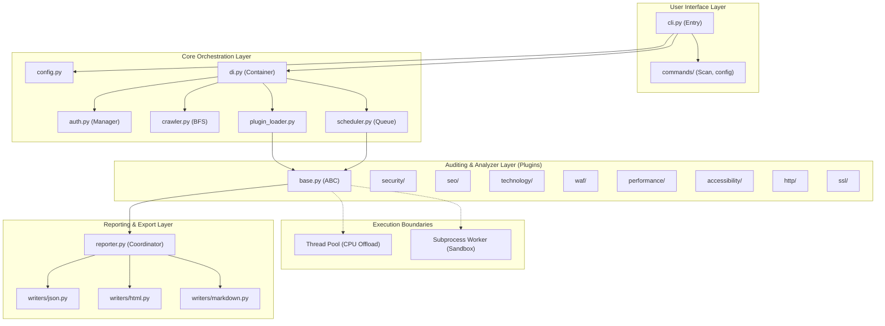
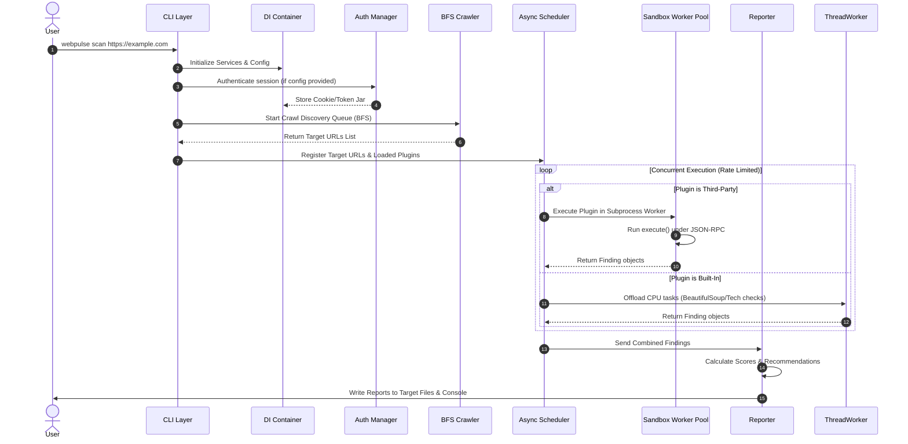

# 03_ARCHITECTURE.md — WebPulse Architecture Specification (v2.0)

## 1. Purpose
This document specifies the system architecture for the WebPulse auditing framework. It defines the structural layers, package boundaries, data flows, plugin integration points, and runtime pipeline execution, serving as the definitive blueprint for developers and AI coding agents.

---

## 2. Overview
WebPulse is structured as a decoupled, multi-layered CLI tool. It prioritizes a clean separation of concerns between the user interface, engine lifecycle management, crawling/discovery, authentication coordinators, analysis orchestrators, and reporting components. All communication between core layers relies on abstractions, preventing circular dependencies and allowing modular swap-out of components.

---

## 3. High-Level Component Architecture

The following Mermaid diagram outlines the WebPulse runtime architecture:



---

## 4. Package Folder Structure
```
webpulse/
│
├── __init__.py
├── cli.py                  # CLI command runner entry point
│
├── core/                   # Core engine layer
│   ├── __init__.py
│   ├── config.py           # Configuration model & file parser
│   ├── di.py               # Dependency injection container
│   ├── auth.py             # Session & authentication manager [NEW]
│   ├── crawler.py          # BFS crawling & URL queue coordinator [NEW]
│   ├── scheduler.py        # Async task scheduler & rate limiter
│   ├── plugin_loader.py    # Plugin discoverer & validator
│   ├── sandbox.py          # Subprocess JSON-RPC sandboxing worker pool [NEW]
│   └── exceptions.py       # Core framework exceptions
│
├── modules/                # Core Auditing Modules (built-in plugins)
│   ├── __init__.py
│   ├── base.py             # Abstract base classes for plugins
│   ├── security/           # HTTP header & endpoint security
│   ├── seo/                # Metadata & structural SEO
│   ├── technology/         # Framework & CMS fingerprinting
│   ├── waf/                # Web Application Firewall detection
│   ├── performance/        # HTTP timings & browser emulation
│   ├── accessibility/      # WCAG DOM accessibility audit
│   ├── http/               # Protocol & redirection checks
│   └── ssl/                # TLS handshake & cert audits
│
├── reports/                # Report generation layer
│   ├── __init__.py
│   ├── reporter.py         # Report generation orchestrator
│   ├── schemas.py          # Pydantic schemas for findings & reports
│   └── writers/            # Exporters
│       ├── json.py
│       ├── html.py
│       ├── markdown.py
│       └── console.py
│
└── utils/                  # Core utility helpers
    ├── __init__.py
    ├── network.py          # Shared async HTTP client with SSRF filter [MODIFY]
    ├── html_parser.py      # BeautifulSoup parsing run in thread executor [MODIFY]
    └── logging.py          # Structured logging configuration
```

---

## 5. Dependency Rules

1. **Inward-Only Rule:** Modules inside `core/` must never import from `modules/` or `reports/`. Core is independent.
2. **Abstract Dependencies:** Code should depend on interfaces (defined in `modules/base.py`) rather than concrete analyzer implementations.
3. **No Direct External Call from Modules:** Plugins must perform all network operations using the shared `network.py` utility. This ensures connection pooling, rate limiting, request timeouts, and SSRF private IP filtering are applied uniformly.

---

## 6. Execution Pipeline & Data Flow

When a scan is triggered, WebPulse executes according to the following timeline:



---

## 7. Dependency Injection Strategy
WebPulse utilizes a simple constructor-based Dependency Injection (DI) pattern managed by a centralized container class (`webpulse.core.di.Container`). 
* The container initializes shared singletons: the global `Config` instance, the authenticated `AsyncHTTPClient` wrapper, the `AuthManager`, the `Crawler`, the `PluginLoader`, and the `AsyncScheduler`.
* When plugins are instantiated (either in the main process or within a subprocess sandbox worker), the scheduler injects the shared network client and the configuration specific to that plugin category. This allows easy mocking of dependencies during test runs.

---

## 8. Architectural Decision Records (ADRs)

### ADR-001: Async-First Execution Model
* **Status:** APPROVED
* **Context:** Auditing websites involves multiple concurrent network requests (SSL handshake, HTTP request, WAF challenge triggers, browser rendering). Synchronous execution would result in excessive wait times on network IO.
* **Decision:** Implement the runtime engine fully asynchronously using `asyncio` and `httpx`.
* **Rationale:** Asynchronous IO is more resource-efficient than thread pools, allowing WebPulse to scale to audit multiple domains on low-end servers without exhausting process handles.

### ADR-002: Class-Based Plugin Registration Decorators
* **Status:** APPROVED
* **Context:** WebPulse must allow third-party developers to easily write plugins without modifying the core codebase or registration files.
* **Decision:** We define a custom decorator `@register_plugin` which subclasses must use. The `PluginLoader` reads these dynamically from specified directory paths.
* **Rationale:** Reduces boilerplate code. Standardizes metadata declarations directly in the class code.

### ADR-003: Playwright for Browser Emulation
* **Status:** APPROVED
* **Context:** Simple HTTP requests cannot execute JavaScript-rendered applications or accurately evaluate modern UX Performance Metrics (e.g. Layout Shift, Largest Contentful Paint).
* **Decision:** Integrate Playwright as an optional dependency for performance and accessibility analyzers.
* **Rationale:** Playwright provides the cleanest async Python API for headless browser interaction and is more stable than Selenium.

### ADR-004: SSRF Outbound Connection Filter
* **Status:** APPROVED (v2.0)
* **Context:** WebPulse scans target URLs provided by users. In shared runner or SaaS environments, malicious users could trigger scans against loopback endpoints (`127.0.0.1`) or cloud metadata services (`169.254.169.254`), leading to server-side request forgery (SSRF).
* **Decision:** Implement an IP resolution check in the shared network client (`webpulse.utils.network`). Before executing requests, resolve hostnames and block connections to private (RFC 1918) and local (RFC 6890) IP address blocks by default.
* **Rationale:** Prevents network boundary exploitation out-of-the-box. Users can opt-in to scan private networks using `--allow-private-ips`.

### ADR-005: Subprocess Plugin Sandboxing
* **Status:** APPROVED (v2.0)
* **Context:** Third-party plugins running in the same process have full read/write access to core singletons, environment variables (secrets), and the filesystem.
* **Decision:** Execute unverified third-party plugins in a separate subprocess worker pool using Python's `multiprocessing` package. Communicate using a JSON-RPC protocol over stdin/stdout.
* **Rationale:** Guarantees isolation. A crashing or memory-leaking plugin cannot bring down the primary async loop or access core engine variables.

### ADR-006: Thread Pool CPU Task Offloading
* **Status:** APPROVED (v2.0)
* **Context:** CPU-intensive routines (e.g., BeautifulSoup DOM construction, regex matching for technology databases) run in Python's single thread. Running them inside the main event loop blocks network task scheduling.
* **Decision:** Offload BeautifulSoup execution and technology detection signature checks to a pool of background worker threads using `asyncio.to_thread` or `loop.run_in_executor`.
* **Rationale:** Maximizes concurrent network throughput by keeping the async event loop thread responsive.

---

## 9. Trade-offs

| Alternative | Chosen Design | Pros | Cons |
|---|---|---|---|
| Go-based Engine (e.g. Nuclei style) | Python AsyncIO Core | Fast development, rich library ecosystem (Playwright, BeautifulSoup), excellent scripting capability. | Slightly higher memory utilization and slower cold boot time than compiled binaries. |
| Subprocess Plugin Isolation | JSON-RPC Subprocess Sandbox | Guarantees secrets safety and process isolation. | Minor latency overhead due to JSON serialization/IPC transport. |
| Synchronous DOM Parsing | Thread-Pool Offloading | Loop concurrency is preserved; network requests do not stutter during parse operations. | Higher memory usage due to holding threads and raw HTML bytes. |

---

## 10. Future Scalability Considerations
As WebPulse scales to handle enterprise scanning, the engine's design supports moving from an in-process async scheduler to a distributed queue model (e.g., Celery or Redis Queue) without changing the core analyzer plugins. The scheduler layer abstracts task execution completely.

---

## 11. References
* Robert C. Martin, *Clean Architecture: A Craftsman's Guide to Software Structure and Design*.
* Python `asyncio` documentation: https://docs.python.org/3/library/asyncio.html
* Playwright Python documentation: https://playwright.dev/python/docs/intro
* RFC 1918 (Private IP): https://datatracker.ietf.org/doc/html/rfc1918
* RFC 6890 (Special-Purpose IP Address Registries): https://datatracker.ietf.org/doc/html/rfc6890

---

## 12. Validation Rules
* No module in `webpulse/core/` is permitted to import any module from `webpulse/modules/` (strict architectural boundary validation using linting tooling).
* Every ADR must define Status, Context, Decision, and Rationale sections.

---

## 13. Engineering Notes
* Be careful with shared HTTP sessions; reuse the client instance from the DI container to leverage connection pooling.

---

## 14. AI Notes
* Respect the package boundaries. If you need to expose a new utility, place it in `webpulse/utils/` rather than adding a helper method directly inside a core module.
* Do not introduce direct imports from concrete plugin classes; always reference `BasePlugin` inside core classes.
